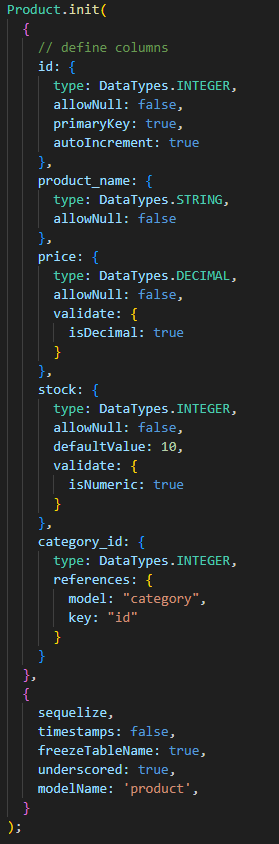
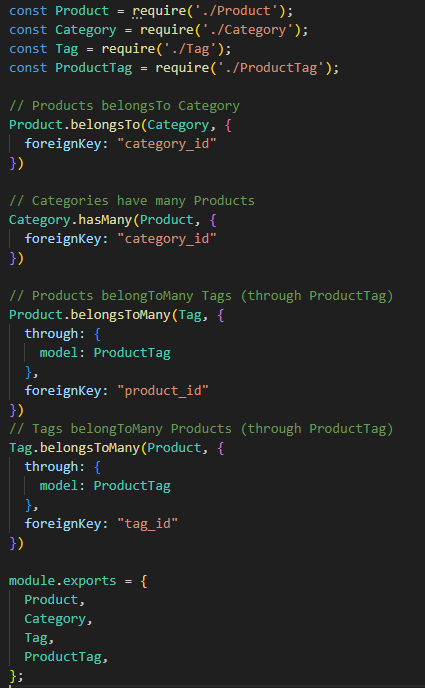
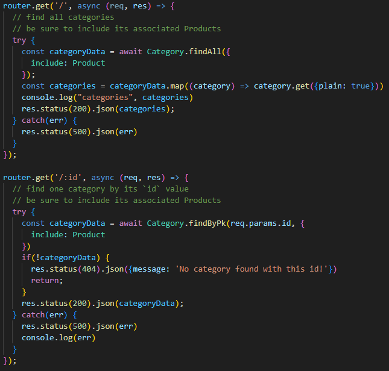
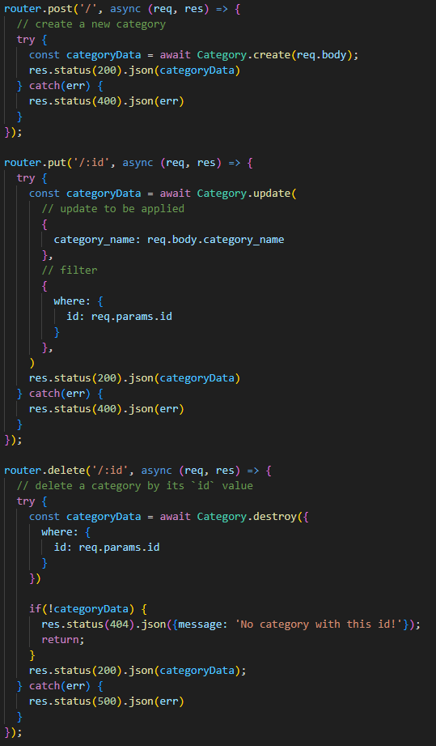

# ecommerce-site-backend

## Description

This project was built as a backend for ecommerce sites, creating our own APIs and database structures with mySQL. It solves the problem of unorganized data and creates structure. Walkthrough video: (https://drive.google.com/file/d/13hOGRVISDj-542y_VyuY9RL7cHA_tlYN/view)

## Table of Contents

- [Installation](#installation)
- [Usage](#usage)
- [Credits](#credits)

## Installation

1. Install node.js and mySQL
2. In the terminal:
    1. mysql -u root -p and create schema
    2. npm install
    3. npm run seed
    4. npm start

## Usage

This model creates a table in the database with this structure by using SQL. It references category id as a foreign key. 

This refers to the different foreign keys and explains where each model belongs/connects.

These get routes retrieves data to display data, either displaying all of it or one category by the id.

The POST request creates a new category through the data provided in the req.body. The PUT request updates a category by changing the req.body through the category_name field. The DELETE request deletes a category through the id.

## Credits

Tutor Joem Casusi
UCB Class Activities